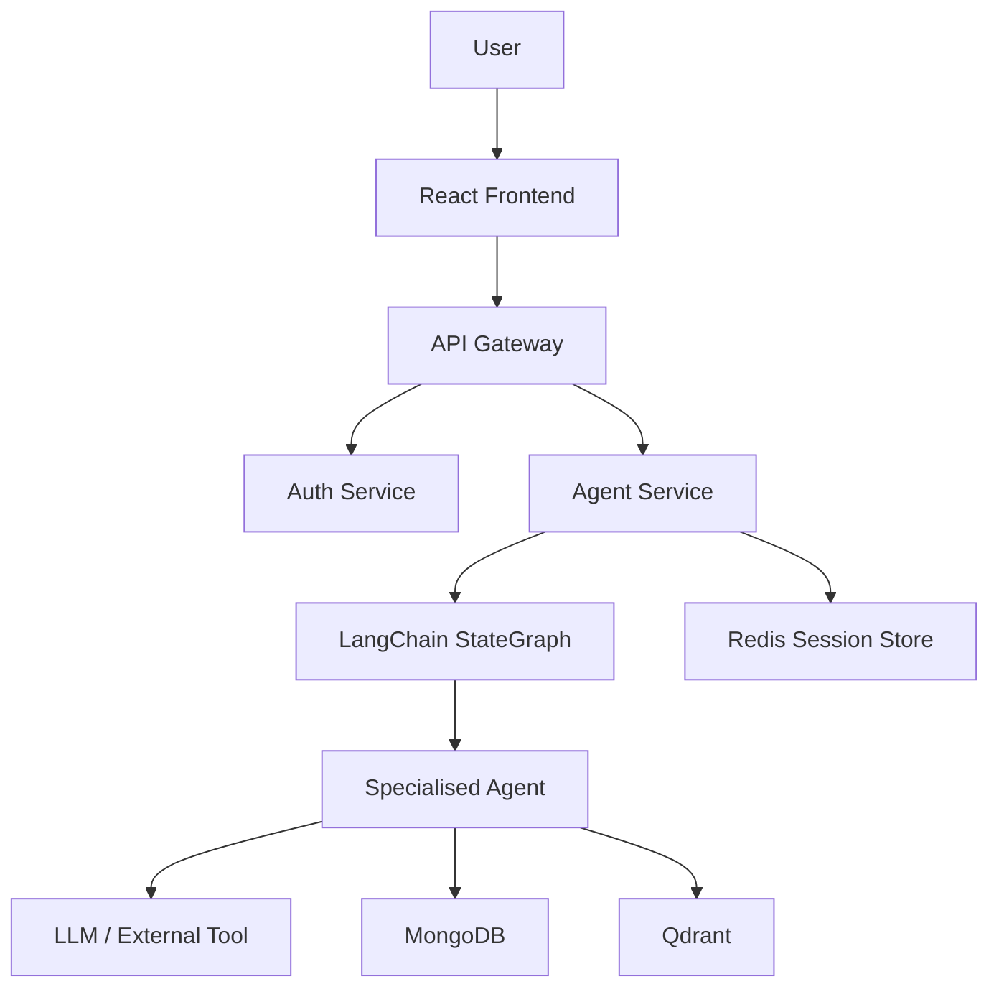

# OMNIX – Multi-Agent AI Platform
 
> A modular full-stack AI platform that orchestrates specialised agents for chat, code generation, document intelligence, web search, vision, and artifact creation.
 
**OMNIX — One Platform. Multiple AI Capabilities.**
 
---
 
## Table of Contents
1. [Project Overview](#1-project-overview)
2. [Why OMNIX?](#2-why-omnix)
3. [Key Features](#3-key-features)
4. [Multi-Agent Capabilities](#4-multi-agent-capabilities)
5. [Technology Stack](#5-technology-stack)
6. [System Architecture](#6-system-architecture)
7. [Request Flow](#7-request-flow)
8. [PDF RAG Pipeline](#8-pdf-rag-pipeline)
9. [Credit & Usage System](#9-credit--usage-system)
10. [Authentication & Security](#10-authentication--security)
11. [Project Structure](#11-project-structure)
12. [API Overview](#12-api-overview)
13. [Local Development](#13-local-development)
14. [Environment Variables](#14-environment-variables)
15. [Current Implementation Status](#15-current-implementation-status)
16. [Future Scope](#16-future-scope)
17. [Author](#17-author)
---
 
## 1. Project Overview
 
OMNIX is a **full-stack Generative AI platform** that lets end-users interact with a single UI while the backend routes requests to specialised AI agents. Each agent focuses on a narrow capability (e.g., chat, code generation, PDF analysis) and is backed by a language model configured in a provider-agnostic way. The system is split into independent micro-services — authentication, billing, chat, and the core **Agent Service** — all orchestrated through an API gateway.
 
- **Problem it solves** – provides a unified interface for many AI-powered functionalities without requiring the user to manage multiple providers or APIs.
- **Why multiple agents** – specialised agents can apply custom prompts, tooling and post-processing, leading to higher quality results than a monolithic handler.
- **User interaction** – the React frontend sends a request (prompt, optional file) to the gateway; the backend authenticates the user, deducts credits, routes the request through a LangChain `StateGraph`, executes the selected agent, and returns a structured response.
- **Backend separation** – each service (auth, billing, chat, agent) runs in its own container, has its own database access, and can be scaled independently.
---
 
## 2. Why OMNIX?
 
- **Single entry point** for chat, coding, search, PDF/PPT processing, image/vision analysis, and artifact generation.
- **Specialised agents** rather than a single giant prompt — each agent has a tailored system prompt and toolset.
- **Provider abstraction** — the `getModel` helper maps an agent name to a concrete model (Groq, Google Gemini, OpenRouter) without hard-coding the provider in the agent logic.
- **Microservice architecture** — clear service boundaries (auth, billing, chat, agent) enable independent development and deployment.
- **Document / RAG workflows** — PDF and PowerPoint agents include chunking, vector-store creation, and similarity search.
- **Credit & usage management** — every agent call passes through a credit-deduction utility, protecting resources and enabling usage-based billing.
- **Extensible** — adding a new agent only requires a new file under `backend/services/agent/agents/` and a case in the router.
---
 
## 3. Key Features
 
| Feature | Description |
|---|---|
| AI conversational chat | Context-aware chat powered by the `chat` agent. |
| Multi-agent architecture | Dynamic routing to specialised agents via a LangChain `StateGraph`. |
| Coding assistance | Code generation, explanation and review with JSON-based artifact output. |
| Web search | Real-time search using the Tavily API (`search` agent). |
| PDF processing | Text extraction (`pdf` agent) and Retrieval-Augmented Generation (`pdf-rag` agent). |
| PowerPoint processing | Slide extraction and Q&A (`ppt` agent). |
| Vision / image analysis | Image description (`vision` agent) and analysis (`imageAnalyzer` agent) using Gemini. |
| Artifact generation | JSON-structured project files returned by the coding agent. |
| Conversation history | Memory retrieval via LangChain `getMemory`. |
| Credit management | Per-agent credit costs with real-time deduction. |
| Authentication | Firebase token verification with Redis-based sessions. |
| File uploads | Multer middleware handles PDF, PPT and image uploads. |
| Persistence | MongoDB for user and billing data; Redis for session state. |
| Docker-based deployment | `docker compose up --build` launches all services locally. |
 
---
 
## 4. Multi-Agent Capabilities
 
The platform defines **eight** agents:
 
| Agent file | Agent name | Purpose | AI / Tooling | Output |
|---|---|---|---|---|
| `chat.agent.js` | `chat` | General conversational assistant | Groq (`openai/gpt-oss-120b`) | `aiResponse` (Markdown) |
| `coding.agent.js` | `coding` | Code generation, explanation and review | OpenRouter (`deepseek-chat`) | `aiResponse` + optional `artifacts` (project files) |
| `search.agent.js` | `search` | Web search via Tavily | Tavily search tool | `searchResults` array |
| `vision.agent.js` | `vision` | Image description | Google Gemini (`gemini-3.6-flash`) | `aiResponse` |
| `imageAnalyzer.agent.js` | `imageAnalyzer` | Image analysis | Google Gemini (`gemini-3.6-flash`) | `aiResponse` |
| `pdf.agent.js` | `pdf` | Plain PDF text extraction & Q&A | Groq LLM | `aiResponse` |
| `pdfRag.agent.js` | `pdf-rag` | Retrieval-augmented answering over PDF content | Groq LLM + Qdrant vector store | `aiResponse` |
| `ppt.agent.js` | `ppt` | PowerPoint slide extraction & Q&A | Groq LLM | `aiResponse` |
 
All agents share a common **state object** (`userId`, `sessionId`, `agent`, `prompt`, `file`, …). Each agent:
1. Checks the user's credit limit (`checkAgentLimit`).
2. Deducts the appropriate credits (`deductCredits`).
3. Loads the configured LLM via `getModel`.
4. Executes its specific logic and returns an updated state.
### AI Providers & Tools
 
| Provider / Tool | Model / Role | Used by |
|---|---|---|
| Groq | `openai/gpt-oss-120b` (default LLM) | `chat`, `search`, `pdf`, `pdf-rag`, `ppt`, `vision` |
| Google Gemini | `gemini-3.6-flash` | `vision`, `imageAnalyzer` |
| OpenRouter | `deepseek-chat` | `coding` |
| Tavily | Web-search API (max 5 results) | `search` |
| Qdrant | Vector store (via `vectorDb.js`) | `pdf-rag` |
 
---
 
## 5. Technology Stack
 
**Frontend**
 
| Technology | Version |
|---|---|
| React | ^19.2.8 |
| Vite | ^8.2.0 |
| Tailwind CSS | ^4.3.3 |
| Axios | ^1.19.0 |
| Firebase (client) | ^12.17.0 |
| Redux Toolkit | ^2.12.0 |
 
**Backend**
 
| Technology | Usage |
|---|---|
| Node.js + Express | API gateway & micro-services |
| Docker / Docker Compose | Container orchestration |
| MongoDB | Persistent user & billing data |
| Redis | Session store |
| Multer | File-upload handling |
| LangChain (`@langchain/*`) | Agent orchestration, memory, text splitters |
| `@langchain/groq` | Groq LLM integration |
| `@langchain/google-genai` | Gemini integration |
| `@langchain/openrouter` | OpenRouter integration |
| `@langchain/tavily` | Web-search tool |
| `@langchain/qdrant` | Vector store integration |
 
---
 
## 6. System Architecture
 

 
The diagram reflects the actual folder layout (`backend/services/...`) and the data flow confirmed by the source code.
 
### Multi-Agent Routing
 
```
Request
   ↓
Agent Controller (builds shared state)
   ↓
Router node (examines state.agent)
   ↓
Selected Agent node (e.g., chatAgent, codingAgent)
   ↓
LLM / Tool invocation
   ↓
Response merged back into state
```
 
The `StateGraph` is defined in `backend/services/agent/graph/`. The router returns `{ next: '<AgentNode>' }`, which the graph follows via a dynamic edge. After the agent finishes, control returns to the router — allowing potential chaining, though the current implementation invokes a single agent per request.
 
---
 
## 7. Request Flow
 
1. User submits a prompt (and optional file) via the React UI.
2. Frontend sends a **POST** to `/api/agent/chat` (`agent.route.js`).
3. Multer processes any uploaded file and forwards the request to the controller.
4. `agent.controller.js` builds the shared state (`userId`, `sessionId`, `agent`, `prompt`, file info, etc.).
5. The `StateGraph` starts at the **router** node, which selects the appropriate agent based on `state.agent`.
6. The selected agent runs — checks credit limits, deducts credits, loads its LLM via `getModel`, and executes its task.
7. The agent returns an updated state containing `aiResponse`, remaining `credits`, and optional `artifacts`.
8. The controller sends the final state back to the frontend.
9. The frontend displays the response and updates the conversation view.
---
 
## 8. PDF RAG Pipeline
 
Implemented in `pdfRag.agent.js`:
 
```text
PDF Upload → Text extraction (pdf-parse) → Chunking (RecursiveCharacterTextSplitter) →
Vector store creation (Qdrant) → Similarity search (optional) → System & Human messages → LLM → Answer
```
 
1. Extract text with `pdf-parse`.
2. Chunk the text using `RecursiveCharacterTextSplitter`.
3. Store chunks in **Qdrant** via `vectorDb.js`.
4. For specific questions, perform a similarity search (top 5 chunks); otherwise use all chunks.
5. Construct system and human messages and invoke the Groq LLM.
6. Return the answer and clean up the uploaded file.
The agent enforces strict rules (no external knowledge, no hallucination). PPT and plain PDF agents follow a similar extraction-then-LLM pattern without vector storage.
 
---
 
## 9. Credit & Usage System
 
Credits are deducted per request according to the table defined in `backend/services/auth/controllers/auth.controller.js`:
 
| Agent | Cost (credits) |
|---|---|
| `chat` | 1 |
| `search` | 5 |
| `coding` | 10 |
| `pdf` | 10 |
| `pdf-rag` | 10 |
| `ppt` | 10 |
| `vision` | 10 |
| `imageAnalyzer` | 10 |
 
- When a request arrives, the agent first calls `checkAgentLimit` (ensures the user has an active plan) and then `deductCredits` subtracts the appropriate amount from the user record in MongoDB and updates the Redis session.
- Users start with **100 free credits** (created in `auth.controller.js`).
- Additional credits can be purchased via the `/api/auth/updateUserPayment` endpoint.
---
 
## 10. Authentication & Security
 
- **Firebase Admin SDK** verifies the ID token supplied by the client (`/api/auth/login`).
- A **Redis session** (`session:<id>`) stores user-specific data (id, name, email, plan, credits) with a 7-day TTL.
- The session ID is sent to the client as an **httpOnly** cookie and is read by protected routes (via the `x-session-id` header or cookie).
- Secrets are kept out of version control via `.gitignore`.
- **Security considerations** — the current implementation trusts the JWT and stores sessions in plain Redis; production hardening (HTTPS, token rotation, rate limiting) would be required.
---
 
## 11. Project Structure
 
```text
OMNIX/
├── frontend/                 # React + Vite UI
│   ├── src/
│   └── package.json
├── backend/
│   ├── gateway/               # API gateway (Express)
│   └── services/
│       ├── auth/               # Firebase auth, Redis sessions, MongoDB user model
│       ├── chat/                # (placeholder – not detailed in this repo)
│       ├── billing/            # Credit & plan management
│       └── agent/               # Core multi-agent service
│           ├── agents/           # Individual agent implementations
│           ├── config/           # LLM and tool configs
│           ├── controllers/      # agent.controller.js
│           ├── graph/            # StateGraph definition (router, state)
│           └── router/           # Express route for agents
├── docker-compose.yml         # Multi-service Docker composition
└── README.md                  # Documentation (this file)
```
 
Key directories:
- **`frontend/`** – UI components, Redux store, API calls.
- **`backend/services/agent/agents/`** – the eight agents.
- **`backend/services/agent/config/`** – model/provider mapping and Tavily search config.
- **`backend/services/auth/`** – user authentication, session handling, credit updates.
---
 
## 12. API Overview
 
| Service | Endpoint | Method | Description |
|---|---|---|---|
| Auth | `/api/auth/login` | POST | Verify Firebase token, create Redis session, return user data. |
| Auth | `/api/auth/logout` | POST | Delete Redis session, clear cookie. |
| Auth | `/api/auth/updateUserPayment` | POST | Update user plan & credits, refresh Redis session. |
| Auth | `/api/auth/deductCredits` | POST | Internal utility — deducts credits for a specific agent. |
| Agent | `/api/agent/chat` | POST (multipart) | Accepts `prompt`, optional `file`; routes to the selected agent based on the `agent` field in the payload. |
 
The gateway forwards authenticated requests to the appropriate micro-service; additional internal routes exist but are not exposed publicly.
 
---
 
## 13. Local Development
 
1. **Clone the repository**
```bash
   git clone <repo-url>
   cd OMNIX
```
2. **Create environment files** — copy the examples (`.env.example`) for each service and fill in your own API keys (Groq, Google, OpenRouter, Tavily, Qdrant, MongoDB URI).
3. **Install frontend dependencies**
```bash
   cd frontend && npm install && cd ..
```
4. **Start all services (Docker Compose)**
```bash
   docker compose up --build
```
   - The **frontend** runs at `http://localhost:5173` (Vite dev server).
   - Backend services expose the ports defined in `docker-compose.yml` (e.g., agent service on `8003`).
5. **Stopping**
```bash
   docker compose down
```
 
---
 
## 14. Environment Variables
 
| Variable | Service | Purpose |
|---|---|---|
| `PORT` | Agent | HTTP port |
| `MONGO_URI` | Agent | MongoDB connection string |
| `REDIS_URL` | Agent | Redis connection URL |
| `GROQ_API_KEY` | Agent | Groq authentication |
| `GOOGLE_API_KEY` | Agent | Gemini authentication |
| `OPENROUTER_API_KEY` | Agent | OpenRouter authentication |
| `TAVILY_API_KEY` | Agent | Tavily search API key |
| `QDRANT_URL` / `QDRANT_API_KEY` | Agent | Qdrant vector store credentials |
| `CHAT_SERVICE_URL`, `AUTH_SERVICE_URL` | Agent | URLs of internal services |
 
> Only variable names are listed here; actual secret values must be kept out of the repository. The auth service has its own `.env` with similar keys.
 
---
 
## 15. Current Implementation Status
 
| Capability | Status |
|---|---|
| Multi-agent architecture | ✅ Implemented (LangChain `StateGraph`) |
| Agent routing | ✅ Implemented (single agent per request) |
| Chat, coding, search, vision, image analysis, PDF, PDF-RAG, PPT | ✅ Implemented |
| Authentication | ✅ Implemented (Firebase + Redis) |
| Conversation history | ✅ Implemented (memory utils) |
| Credit management | ✅ Implemented (cost table, deduction, plan updates) |
| Artifact generation | ✅ Implemented (code generation returns JSON files) |
| PDF RAG vector store | ✅ Implemented (Qdrant) |
| Automated tests | ❌ Not currently included |
 
---
 
## 16. Future Scope
 
- Additional agents (e.g., audio transcription, video summarisation).
- Advanced orchestration — multi-step pipelines where the output of one agent feeds another.
- Observability — structured logging, metrics (Prometheus), and tracing.
- Automated testing — unit tests for each agent with mock LLMs, plus a CI pipeline.
- OpenAPI specification for all endpoints.
- Production hardening — HTTPS, rate limiting, secret/token rotation.
- CI/CD — GitHub Actions for Docker image builds and deployments.
- Scalable deployment — Helm charts for Kubernetes, auto-scaling of services.
---
 
## 17. Author
 
**Lucky Gupta**
School of Management Sciences, Lucknow
 
---
 
OMNIX demonstrates a practical approach to building modular Generative AI systems by combining full-stack development, microservice architecture, LangChain-based agent orchestration, document intelligence, external AI tools, persistent conversations, authentication, and usage management in a unified platform.
 